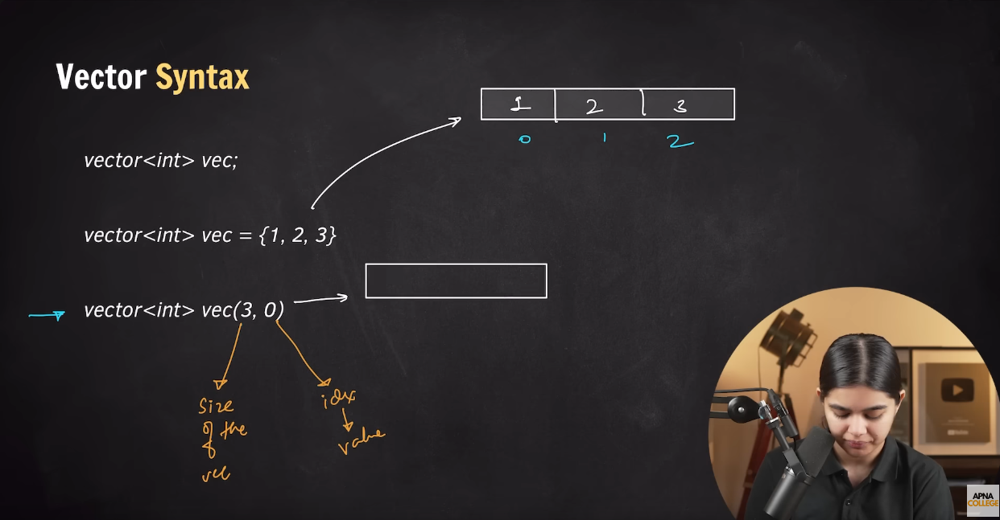
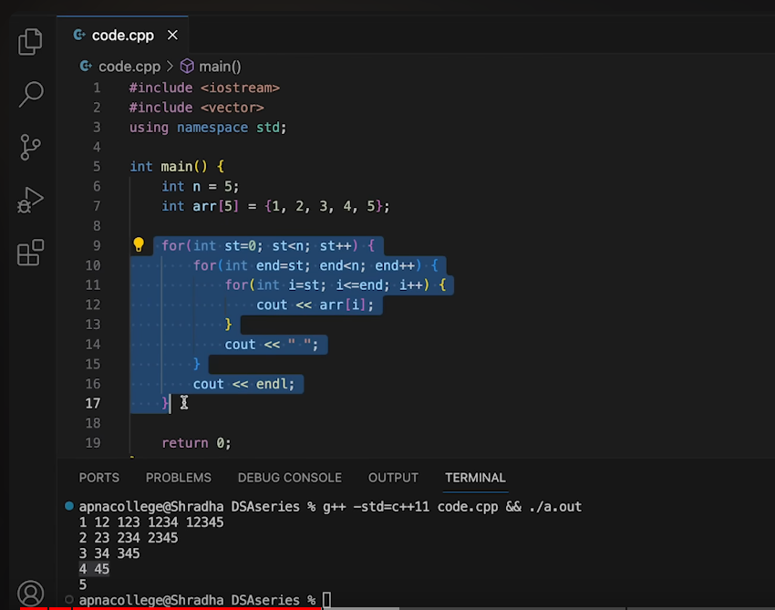

# Learning DSA Using cpp
## STD: Stardered Template Library

### Syntax: 
- ` vector<int> vec_name` 
- ` vector<int> vec_name = {1, 2, 3}`
- ` vector<int> vec_name(3, 0)`

# Vector in CPP: 
- Vectors are the same as dynamic arrays with the ability to resize themselves automatically when an element is inserted or deleted.
- std::vector in C++ is the class template that contains the vector container and its member functions.
- An array is a collection of elements of the same data type, stored in contiguous memory locations. It's accessed using an index, which is a numerical value that represents the position of an element within the array. Arrays are often used to store and manipulate groups of related data efficiently.

## Key Characteristics of Vectors: 
- Vectors automatically resize when you add or remove elements.
- Since vector elements are stored in contiguous memory locations, you can access elements in constant time using their index, similar to arrays.

## Syntax of Vector Declearation: 
`- std::vector<dataType> vectorName;`

### Initialization Using List 
- vector<dataType> name({ value1, value2, value3 ....}); 
- std::vector<int> myVector({1, 2, 3, 4, 5})

### Initialization With a Single Value:
` Syntax:`
- std::vector<dataType> name(size, value);

`Example:`
- std::vector<int> myVectot(5,0);

### Initialization From Another Vector:
`Syntax: `
- std::vector(dataType) name(pther_vector);

`Example: `
- std::vector<int> myNewVector(myVector);

### All Types of Vector Initialization Syntax: 

# Kadane's Algorithm:
## Maximum Sub Array:
- A sub array is a continious part of an array.
- `Formula`:  (n * (n + 1)) / 2 

### Simple Approach code:
